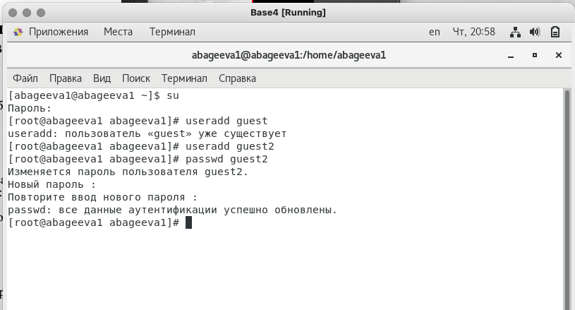
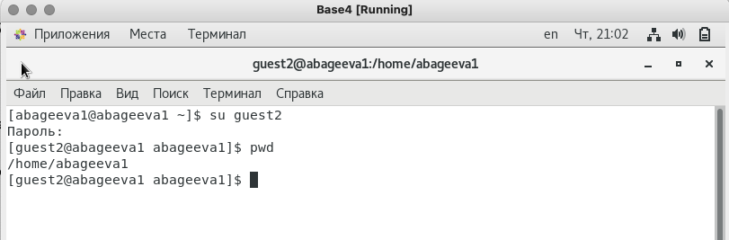
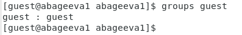

---
## Front matter
lang: ru-RU
title: Отчёт по лабораторной работе 3
author: 'Агеева Анастасия Борисовна'
date: 14 октября, 2021

## Formatting
toc: false
slide_level: 2
theme: metropolis
mainfont: PT Serif
romanfont: PT Serif
sansfont: PT Sans
monofont: PT Mono
header-includes: 
 - \metroset{progressbar=frametitle,sectionpage=progressbar,numbering=fraction}
 - '\makeatletter'
 - '\beamer@ignorenonframefalse'
 - '\makeatother'
aspectratio: 43
section-titles: true
---

## Цель работы

Получение практических навыков работы в консоли с атрибутами файлов, закрепление теоретических основ дискреционного разграничения доступа в современных системах с открытым кодом на базе ОС Linux1.

## Задание

Лабораторная работа подразумевает дискреционное разграничение прав в Linux. Освоение основны атрибутов

# Выполнение лабораторной работы

1. В установленной операционной системе создаем учётную запись пользователя guest (использую учётную запись администратора). Такая учетная запись уже есть, поэтому переходим к след пункту. (рис.1)

---

2. Аналогично создаем второго пользователя guest2 (рис.1).

   { #fig:001 width=60% }

---

3. Добавляем пользователя guest2 в группу guest. (рис.2).

   { #fig:002 width=60% }

---

4. Осуществляем вход в систему от двух пользователей на двух разных консолях: guest на первой консоли и guest2 на второй консоли.

---

5. Для обоих пользователей командой pwd определяем директорию, в которой мы находимся. Сравнним её с приглашениями командной строки. (рис.3-4).

   { #fig:003 width=60% }

---

6. Уточняем имя нашего пользователя, его группу, кто входит в неё
и к каким группам принадлежит он сам. Определяем в какие группы входят пользователи guest и guest2. Сравним вывод команды groups с выводом команд id -Gn и id -G. (рис.4-7).

   { #fig:006 width=60% }

---

   { #fig:004 width=60% }

---

   { #fig:005 width=60% }

---

   { #fig:051 width=60% }

---

7. Сравним полученную информацию с содержимым файла /etc/group. Просмотрим файл.(рис.8-9)

   { #fig:081 width=60% }

---

   { #fig:082 width=60% }

---

8. От имени пользователя guest2 выполним регистрацию пользователя guest2 в группе guest. (рис.10).

   { #fig:007 width=60% }
   
---

9. От имени пользователя guest изменим права директории /home/guest, разрешив все действия для пользователей группы. (рис.11).

   { #fig:008 width=60% }

---

10. От имени пользователя guest снимим с директории /home/guest/dir1 все атрибуты (рис.8).

---

11. Заполним таблицу «Установленные права и разрешённые действия для групп». (рис.12-13; табл. 1)

   { #fig:009 width=60% }

---

   { #fig:010 width=60% }

---

   |Правка директории|Права файла|Создание файла|Удаление файла|Запись в файл|Чтение файла|Смена директории|Просмотр файлов в директории|Переименование файла|Смена атрибутов файла|
   |:--------------- |:---------:|:------------:|:-------------|:-----------:|:----------:|:---------------|:--------------------------:|:------------------:|--------------------:|
   | d(000)          |	(000)    |      -       |      -       |      -      |      -     |        -       |              -             |          -         |         -          |
   | d(010)          |	(000)    |      -       |      -       |      -      |      -     |        +       |              -             |          -         |         +          |
   | d(020)          |	(000)    |      -       |      -       |      -      |      -     |        -       |              -             |          -         |         -          |
   | d(030)          |	(000)    |      +       |      +       |      +      |      -     |        +       |              -             |          +         |         -          |
   | d(40)          |	(000)    |      -       |      -       |      -      |      -     |        -       |              +             |          -         |         -          |
   | d(050)          |	(000)    |      -       |      -       |      -      |      +     |        +       |              +             |          -         |         -          |
   | d(060)          |	(000)    |      -       |      -       |      -      |      -     |        -       |              +             |          -         |         -          |
   | d(070)          |	(000)    |      +       |      +       |      +      |      +     |        +       |              +             |          +         |         +          |
  
   

---

12. Минимальные права для совершения операций от имени пользователей входящих в группу. (табл. 2)

---

  |       Операция       |Минимальные права на директорию|Минимальные права на файл|
   |:-------------------- |:-----------------------------:| -----------------------:|
   |    Создание файла    |              d-wx             |           d---          |
   |    Удаление файла    |              d-wx             |           d---          |
   |     Чтение файла     |              dr-x             |           dr--          |
   |     Запись в файл    |              d-wx             |           d-w-          |
   | Переименование файла |              d-wx             |           d---          |
   |Создание поддиректории|              d-wx             |           d---          |
   |Удаление поддиректории|              d-wx             |           d---          |

# Выводы

Мы получили практические навыки работы в консоли с атрибутами файлов, закрепили теоретические основы дискреционного разграничения доступа в современных системах с открытым кодом на базе ОС Linux1.

## {.standout}

Спасибо за внимание
