---
# Front matter
lang: ru-RU
title: 'Отчёт'
subtitle: 'по лабораторной работе 3'
author: 'Агеева Анастасия Борисовна'

# Formatting
toc-title: 'Содержание'
toc: true # Table of contents
toc_depth: 2
lof: true # List of figures
lot: true # List of tables
fontsize: 11pt
linestretch: 1.5
papersize: a4paper
documentclass: scrreprt
polyglossia-lang: russian
polyglossia-otherlangs: english
mainfont: PT Serif
romanfont: PT Serif
sansfont: PT Sans
monofont: PT Mono
mainfontoptions: Ligatures=TeX
romanfontoptions: Ligatures=TeX
sansfontoptions: Ligatures=TeX,Scale=MatchLowercase
monofontoptions: Scale=MatchLowercase
indent: true
pdf-engine: lualatex
header-includes:
  - \linepenalty=10 # the penalty added to the badness of each line within a paragraph (no associated penalty node) Increasing the value makes tex try to have fewer lines in the paragraph.
  - \interlinepenalty=0 # value of the penalty (node) added after each line of a paragraph.
  - \hyphenpenalty=50 # the penalty for line breaking at an automatically inserted hyphen
  - \exhyphenpenalty=50 # the penalty for line breaking at an explicit hyphen
  - \binoppenalty=700 # the penalty for breaking a line at a binary operator
  - \relpenalty=500 # the penalty for breaking a line at a relation
  - \clubpenalty=150 # extra penalty for breaking after first line of a paragraph
  - \widowpenalty=150 # extra penalty for breaking before last line of a paragraph
  - \displaywidowpenalty=50 # extra penalty for breaking before last line before a display math
  - \brokenpenalty=100 # extra penalty for page breaking after a hyphenated line
  - \predisplaypenalty=10000 # penalty for breaking before a display
  - \postdisplaypenalty=0 # penalty for breaking after a display
  - \floatingpenalty = 20000 # penalty for splitting an insertion (can only be split footnote in standard LaTeX)
  - \raggedbottom # or \flushbottom
  - \usepackage{float} # keep figures where there are in the text
  - \floatplacement{figure}{H} # keep figures where there are in the text
---

# Цель работы

Получение практических навыков работы в консоли с атрибутами файлов для групп пользователей.
# Задание

Лабораторная работа подразумевает дискреционное разграничение прав в Linux. Два пользователя

# Выполнение лабораторной работы

1. В установленной операционной системе создаем учётную запись пользователя guest (использую учётную запись администратора). Такая учетная запись уже есть, поэтому переходим к след пункту. (рис.1)

2. Аналогично создаем второго пользователя guest2 (рис.1).

   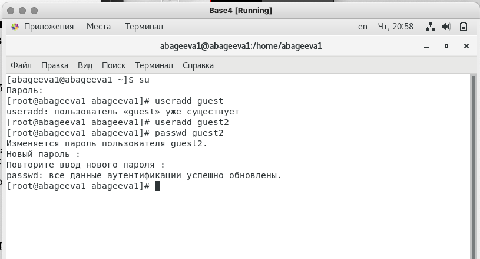{ #fig:001 width=60% }

3. Добавляем пользователя guest2 в группу guest. (рис.2).

   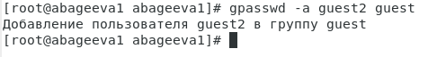{ #fig:002 width=60% }

4. Осуществляем вход в систему от двух пользователей на двух разных консолях: guest на первой консоли и guest2 на второй консоли.

5. Для обоих пользователей командой pwd определяем директорию, в которой мы находимся. Сравнним её с приглашениями командной строки. (рис.3-4).

   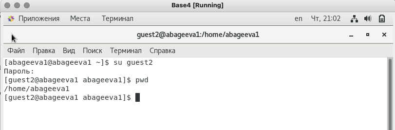{ #fig:003 width=60% }

6. Уточняем имя нашего пользователя, его группу, кто входит в неё
и к каким группам принадлежит он сам. Определяем в какие группы входят пользователи guest и guest2. Сравним вывод команды groups с выводом команд id -Gn и id -G. (рис.4-7).

   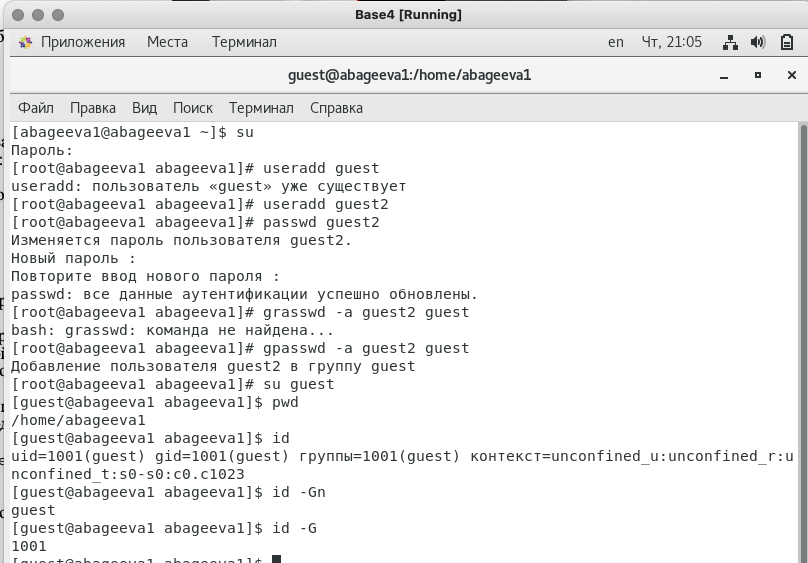{ #fig:006 width=60% }

   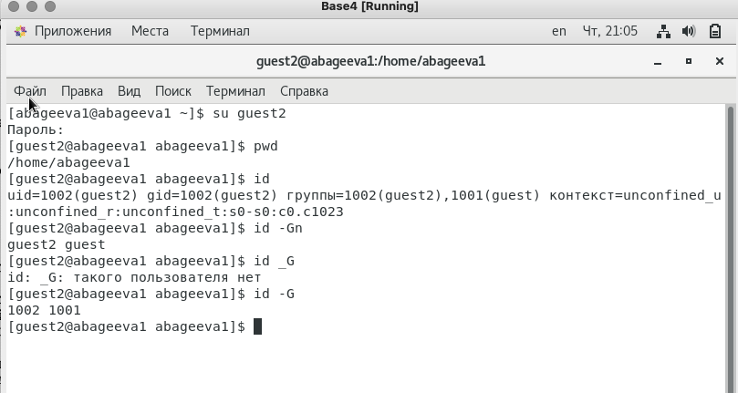{ #fig:004 width=60% }

   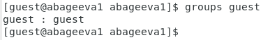{ #fig:005 width=60% }

   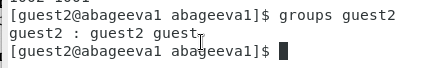{ #fig:051 width=60% }

7. Сравним полученную информацию с содержимым файла /etc/group. Просмотрим файл.(рис.8-9)

   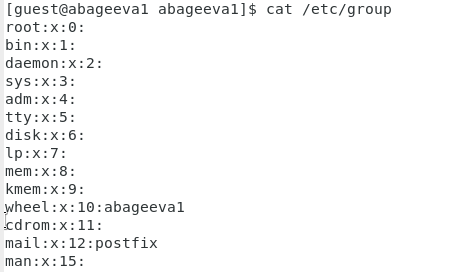{ #fig:081 width=60% }

   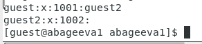{ #fig:082 width=60% }

8. От имени пользователя guest2 выполним регистрацию пользователя guest2 в группе guest. (рис.10).

   { #fig:007 width=60% }
   
9. От имени пользователя guest изменим права директории /home/guest, разрешив все действия для пользователей группы. (рис.11).

   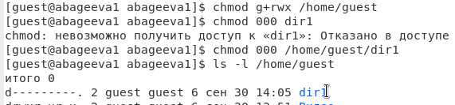{ #fig:008 width=60% }

10. От имени пользователя guest снимим с директории /home/guest/dir1 все атрибуты (рис.8).

11. Заполним таблицу «Установленные права и разрешённые действия для групп». (рис.12-13)

   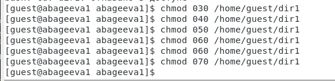{ #fig:009 width=60% }

   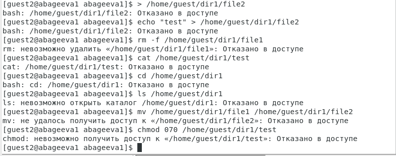{ #fig:010 width=60% }

   |Правка директории|Права файла|Создание файла|Удаление файла|Запись в файл|Чтение файла|Смена директории|Просмотр файлов в директории|Переименование файла|Смена атрибутов файла|
   |:--------------- |:---------:|:------------:|:-------------|:-----------:|:----------:|:---------------|:--------------------------:|:------------------:|--------------------:|
   | d(000)          |	(000)    |      -       |      -       |      -      |      -     |        -       |              -             |          -         |         -          |
   | d(010)          |	(000)    |      -       |      -       |      -      |      -     |        +       |              -             |          -         |         +          |
   | d(020)          |	(000)    |      -       |      -       |      -      |      -     |        -       |              -             |          -         |         -          |
   | d(030)          |	(000)    |      +       |      +       |      +      |      -     |        +       |              -             |          +         |         -          |
   | d(40)          |	(000)    |      -       |      -       |      -      |      -     |        -       |              +             |          -         |         -          |
   | d(050)          |	(000)    |      -       |      -       |      -      |      +     |        +       |              +             |          -         |         -          |
   | d(060)          |	(000)    |      -       |      -       |      -      |      -     |        -       |              +             |          -         |         -          |
   | d(070)          |	(000)    |      +       |      +       |      +      |      +     |        +       |              +             |          +         |         +          |
  
   
12. Минимальные права для совершения операций от имени пользователей входящих в группу.

   |       Операция       |Минимальные права на директорию|Минимальные права на файл|
   |:-------------------- |:-----------------------------:| -----------------------:|
   |    Создание файла    |              d-wx             |           d---          |
   |    Удаление файла    |              d-wx             |           d---          |
   |     Чтение файла     |              dr-x             |           dr--          |
   |     Запись в файл    |              d-wx             |           d-w-          |
   | Переименование файла |              d-wx             |           d---          |
   |Создание поддиректории|              d-wx             |           d---          |
   |Удаление поддиректории|              d-wx             |           d---          |

# Выводы

Я получила практические навыки работы в консоли с атрибутами файлов для групп пользователей
